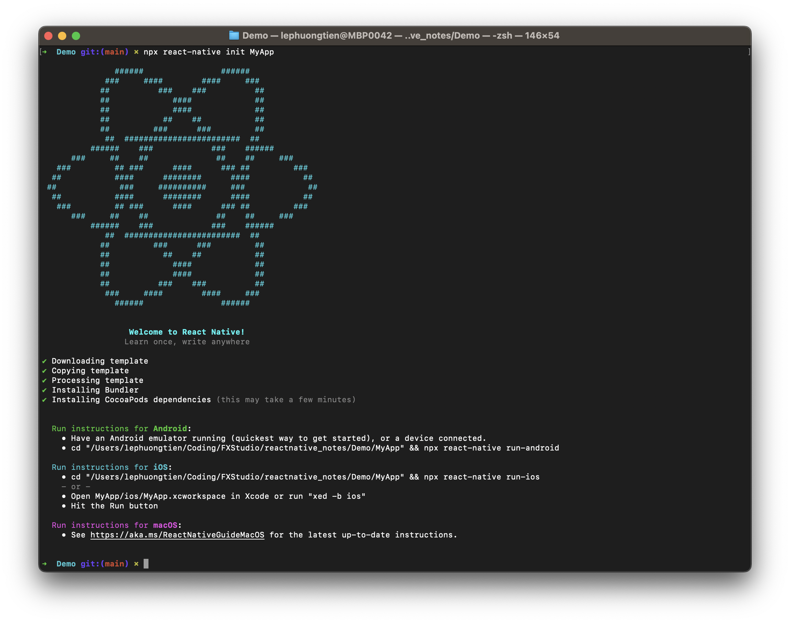
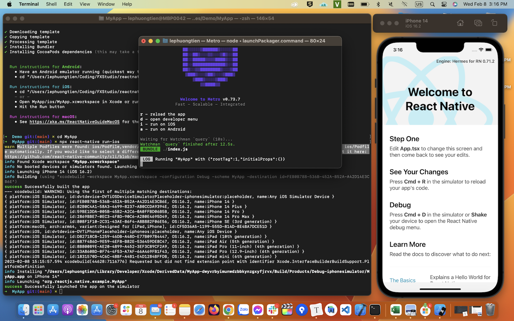
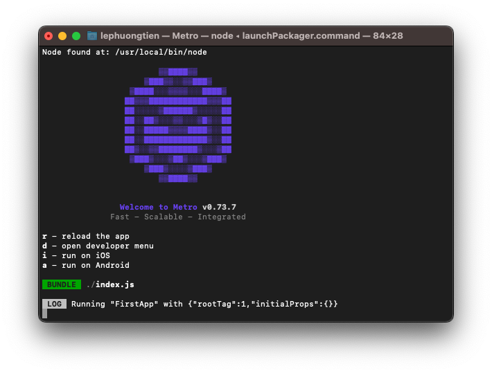
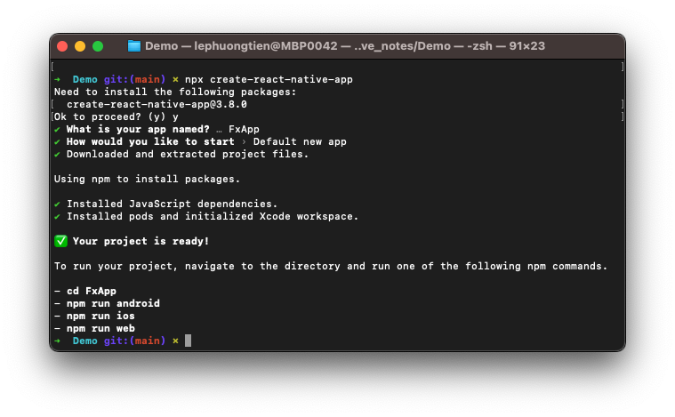

# 001 - Cài đặt môi trường
Các thứ để có thể Hello world nhóe!

## Yêu cầu

ReactNative kế thừa lại ReactJS. Do đó, yêu cầu đầu tiên thì cần nắm qua được kiến thức ReactJS. Hoặc ít nhất cần biết về các kiến thức sau trong ReactJS:

- JSX (một biến thể của Javascript)
- React Component
- Component Lifecycle – vòng đời của một Component.
- React Hook
- Props, State
- Xử lý xử kiện (Handling event)

## Ưu & Nhược

*(Cái này ai cũng biết rồi, nên ta bỏ qua nhóe!)*

## Expo & CLI

### Expo

**Expo** là nền tảng cung cấp các công cụ để xây dựng ứng dụng React Native với đầy đủ chức năng mà không cần phải viết code native, tức là bạn viết ứng dụng hoàn toàn 100% bằng Javascript.

Tóm tắt:

* Cần cần cài thêm Xcode hay Android Studio
* Không cần cái thêm máy ảo
* Tích hợp sẵn các tính năng phổ biến, như: *Push Notification, Asset Managers, OTA (Over-The-Air)...*
* Bị giới hạn trong hệ sinh thái của Expo
* Kích thước file build khá lớn

### CLI

**React Native CLI** là một tính năng có sẵn trong React Native giúp bạn quản lý dự án. Bạn có thể dễ dàng tạo mới và chạy các ứng dụng thông qua giao diện dòng lệnh.

> Sử dụng CLI để tạo dự án.

## Cài đặt môi trường

Làm theo từng bước nhóe!

**Bước 1**: Cài đặt **Homebrew**

```sh
/usr/bin/ruby -e “$(curl -fsSL https://raw.githubusercontent.com/Homebrew/install/master/install)"
```

**Bước 2**: Cài đặt **NodeJS**

```sh
brew install node
```

**Bước 3**: Cài đặt **JDK** --> tốt nhất lên web tìm và tải file cài đặt về rồi cài. Cài xong kiểm trả JDK version nhóe.

```sh
java -version
```

**Bước 4**: Cài đặt **React Native CLI**

```sh
npm install -g react-native-cli
```

> Với anh em dev sài macos thì cài thêm `cocoapods` nữa cho chắc nhóe.

## IDE & Simulator

* **Android**
  * Cài Android Studio
  * Tải thêm Android SDK
  * Android SDK Platform
  * Android Virtual Device (máy ảo)
* **iOS**
  * Cài Xcode
  * Cài Xcode Command Line Tools
  * Tải các iSimulator cần thiết
* **VS Code**
  * Cài thêm các extensions cho React Native
    * React Native Tools
    * ESLint
    * Prettier — JavaScript formatter
    * TODO Highlight
    * Import const
    * VSCode React Refactor

## Hello world

Khi đã cài đặt xong môi trường thì ta tiến hành `Hello world` em nó nhóe.

### Tạo app

Đầu tiên bạn cần dùng Terminal `cd` về thư mục nào đó mà bạn chuẩn bị để tạo ứng dụng đầu tiên.  Để tạo ứng dụng bạn sử dụng cú pháp sau:

```sh
npx react-native init `ProjectName`
```

`Hello` là tên ứng dụng của bạn. Gõ lệnh mà chờ một chút, vì lần đầu tạo hơi lâu. Có một lưu ý là đừng nên chọn mấy cái tên có chữ `Hello` hay `HelloWorld` nhóe.

> *Ở các phiên bản React Native mới nhất, CLI được tích hợp sẵn. Thay vì phải cài đặt và quản lý một phiên bản React Native CLI riêng biệt, chúng ta nên sử dụng phiên bản CLI được cài đặt sẵn đi kèm với NodeJS bằng cách sử dụng `npx`.*

Nếu hiện ra hình như thế này là thành công.



Còn nếu không tức là việc tạo ứng dụng bị lỗi. Bạn cần bình tĩnh.

* Copy lỗi và search google xem như thế nào
* Tiến hành xóa CLI & React Native
* Cài lại CLI & React Native

```sh
// delete
npm uninstall -g react-native
npm uninstall -g react-native-cli

// check
npm -g list

// install
install new react-native global
npm install -g react-native-cli
npm install -g react-native
```

Rồi tiến hành chạy lại lệnh, nếu vẫn lỗi tiếp thì kiểu tra lại ruby version sẽ đúng theo yêu cầu chưa. Nếu chưa bạn hãy update tiếp Ruby cho máy nhóe.

> *Nếu bạn chạy lần đầu thì thời gian chờ cái CocoaPods khá là lâu. Hãy đảm bảo đường truyền mạng tốt nhóe.*

### Run app

Sau khi, bạn đã hoàn thành bước tạo app thành công. Chúng ta tiếp tục việc `run` ứng dụng. Bạn hãy `cd` tới thư mục project bạn vừa tạo. Sau đó, bạn chọn iOS hay Android để chạy.

```sh
// iOS
npx react-native run-ios

// Android
npx react-native run-android
```

Bạn tiếp tục chờ thêm một tí nữa. Nếu như may mắn thì sẽ gọi được Simulator và ứng dụng sẽ được hiển thị trong đấy. Còn xui thì đen thôi, chứ đỏ là như hình dưới dây.



## Cấu trúc cơ bản của Project

Vào thư mục của dự án thì bạn sẽ thấy một số thư mục quan trọng như sau:

- **android**: nơi bạn viết code native (Java/Kotlin) trong trường hợpbạn cần can thiệp sâu vào hệ thống android, cần phải gọi cácAPI Android Native.
- **ios**: tương tự thư mục Android, nhưng dành cho iOS.
- **App.js/App.tsx**: Đây là root component của ứng dụng. Thông thườngchúng ta sẽ cấu hình Header, StatusBar, Store... tại đây.
- **index.js**: Là tệp đầu tiên được gọi, giống với *index.html* trongcác ứng dụng web vậy. Tại đây bạn sẽ đăng ký root componentvới hệ thống.
- **package.json**: Tương tự các dự án được quản lý *dependencies* bằng *NPM*. File này sẽ chứa cấu hình câu lệnh run, build, danhsách các thư viện,v.v...

## index.js

Như mình đã đề cập ở trên, tệp `index.js` được hệ thống đọc đầu tiên,trong đó **AppRegistery** là điểm bắt đầu để chạy ứng dụng **ReactNative**.

Các root component (trong trường hợp này là App component) cầnphải được đăng ký để hệ thống native có thể load bundle của app vàchạy ứng dụng. Câu lệnh đăng ký là AppRegistry.registerComponent

Ngoài ra, nhìn đoạn code trên, bạn có nhận ra điều gì đặc biệt không?

Đó là hoàn toàn không có react-dom như ứng dụng ReactJS mà bạn vẫn hay làm. Đây cũng chính là một điểm khác biệt lớn của ReactNative so với ReactJS.

## app.js / app.txs

Phần tiếp theo là nội dung chính của component. Đây là nơi chúng ta render những thành phần hiển thị trong ứng dụng.

Tìm tới đoạn code `Section title`, tiến hành ra nội dung. Sau đó bấn Ctr + s đề lưu lain

## Style cho component

Cũng tương tự như ReactJS, bạn có thể định dạng - “trang trí” cho component bằng style. Về cơ bản thì style này nó cũng có các thuộc tính như CSS mà bạn vẫn hay làm trên web vậy.

> Tìm hiểu sau nhóe!

## Debug

Công việc không thể thiếu. Khi chúng ta thực hiện lệnh `run` thì bạn sẽ thấy có một cửa sổ chạy Metro như bên dưới đây:



Click vào cửa sổ này và nhấn phím “D” trên bàn phím. Lúc này trên máy ảo sẽ xuất hiện một danh sách dev menu. Chúng ta có thể lựa chọn vào tìm hiểu thêm nhóe.

> Hiện tại, mình lỗi chỗ này rồi nên chưa khám phá trình Debug như thế nào.

## Sử dụng Expo để tạo ứng dụng với các template

Truy cập vào đây: https://github.com/expo/create-react-native-app

Mình sẽ tạo ứng dụng React Native nhanh hơn có thể lựa chọn các template có sẵn bằng việc sử dụng gói Expo này.

Bắt đầu, bạn hãy gõ lệnh và làm theo hướng dẫn nhóe

```sh
npx create-react-native-app
```

Bạn có thể chọn template mặc định hoặc theo các template mà gói cung cấp (có khá nhiều template),



> Khi bạn dùng với Expo thì bạn cũng cần phải chú ý. Vì sẽ bị giới hạn các tính năng trong gói cung cấp. Có thời gian sẽ tìm hiểu tiếp.


Tới được đây cũng xem là **Hello world** thành công rồi đấy. Chúc bạn một ngày tốt lành!

## Câu hỏi tìm hiểu

1. Import `React` trong code để làm gì?
2. Các cú pháp mà React Native sử dụng? Cách chuyển đổi giữa các cú pháp đấy.

---

*(Chúc bạn một ngày tốt lành và cảm ơn bạn đã ghé thăm repo này.)*