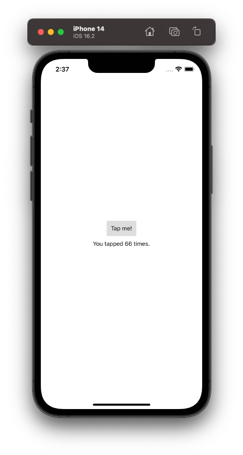

# 001 - Hello world

Một bài nhỏ chú thích lại cách Hello world cho ReactNative nhóe.

## Chuẩn bị

Yêu cầu, bạn cần phải hoàn thành xong phần [cài đặt môi trường](./001_CaiDatMoiTruong.md) trước đã nhóe.

## Tạo file

Bắt đầu, bạn hãy tạo riêng cho mình một file ứng dụng trong thư mục project nhóe. Có 2 format mà bạn có thể dùng:

* `*.js`
* `*.tsx`

Mình chọn file `*.tsx` và đặt tên `NewApp.tsx`.

## Imports

Tiếp theo, bạn tiến hành `import` nhũng thứ cần thiết vào file **NewApp** nhóe.

```js
import React from "react";
import { Text, View } from "react-native";
```

Trong đó:

* React là tất cả những gì bạn cần.
* Text & View là các kiểu Component mà bạn sẽ sử dụng. Nó có trong gói `react-native`

## App Component

Theo tư tưởng của React thì tất cả đều là Component. Do đó, thành phần gốc của một màn hình đơn giản như bài này, bạn có thể chọn một Component đơn giản. Ví dụ như sau:

```js
const NewApp = () => {
    return(
        <View>
        </View>
    )
}
```

Trong đó:

* Bạn tạo ra một hằng số là `NewApp`
* Cú pháp hàm bạn chưa cần tìm hiểu
* Bạn sẽ hiểu là nó sẽ `return` về một Component, ở đây là `<View></View>` nhóe.

## Props

Đây chính là các thuộc tính của một Component. Nó sẽ nhận dữ liệu từ ngoài truyền cho Component.

Với ví dụ, bạn sẽ có `style` là thuộc tính cho `View`.

```js
const NewApp = () => {
    return(
        <View
            style={{
                flex: 1,
                justifyContent: 'center',
                alignItems: 'center'
            }}>
            
        </View>
    )
}
```

## Elements

Tiếp theo, bạn sẽ thêm các Component con cho Component cha. Với ví dụ Hello world đơn giản như vậy, ta sẽ lựa chọn `<Text></Text>`.

```js
const NewApp = () => {
    return(
        <View
            style={{
                flex: 1,
                justifyContent: 'center',
                alignItems: 'center'
            }}>
            <Text>Hello, world!</Text>
        </View>
    )
}
```

> EZ Gane!

## State

Chính là các trạng thái của các Component. Cho dễ hiểu thì:

> Việc hiển thị nội dung của một Component sẽ liên quan tới 1 biến trạng thái nào đó. Khi biến đó thay đổi giá trị, Component sẽ được render lại với giá trị mới đấy.

Nhiệm vụ của bạn khá đơn giản: "cập nhật giá trị cho State". Phần còn lại, React Native đã lo. Bao gồm luôn phần Binding 2 chiều rồi nhóe.

Ta có code ví dụ như sau:

```js
const NewApp = () => {

    const [count, setCount] = useState(0);

    return(
        <View
            style={{
                flex: 1,
                justifyContent: 'center',
                alignItems: 'center'
            }}>  
            <TouchableOpacity
                style={{
                    alignItems: 'center',
                    backgroundColor: '#DDDDDD',
                    padding: 10,
                    marginBottom: 10,
                }}
                onPress={ ()=> setCount(count + 1) }>
                <Text>Tap me!</Text>
            </TouchableOpacity>
            <View>
                <Text>You tapped {count} times.</Text>
            </View>

        </View>
    )
}
```

Trong đó:

* Cấu trúc lại các Component cho phù hợp với giao diện có 1 Button và 1 View nhóe
* Thêm `style` cho Button
* Thêm `onPress` là sự kiện cho việc click

> Cú pháp của các State bạn sẽ tìm hiểu sau nha.

Bạn có 2 phần:

* Khai báo State
* Lấy giá trị của State vào Text

## App Register

Cuối cùng, bạn đăng ký NewApp của bạn Component chính cho cả ứng dụng. Tại file `index.js`, bạn thên import cho NewApp nha.

```js
import NewApp from './NewApp';
```

Tiếp theo, bạn sẽ đăng ký với AppRegistry như sau:

```js
AppRegistry.registerComponent(appName, () => NewApp);
```

Trong đó, AppRegisty sẽ có tham số mới là NewApp.Tới đây thì bấm nút để test nhóe!



---

*(Chúc bạn một ngày tốt lành và cảm ơn bạn đã ghé thăm repo này.)*