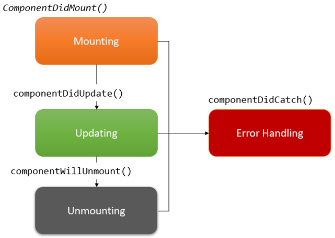

# 002 - Component
Tiếp tục, chúng ta khám về khái niệm lớn **Component** trong **React Native**.

## Khái niệm

Ta có định nghĩa cho Component như sau:

> *Trên giao diện một màn hình ứng dụng, chúng ta chia nhỏ những phần giao diện có đặc điểm giống nhau thành một block, và gọi block này là component.*

Đây là một khái niệm quan trọng trong React Native. Nó vừa là thành phần cốt lõi, vừa ảnh hưởng toàn bộ lên UI ứng dụng. Chúng có thể lồng nhau và tái sử dụng cao. Cũng nhờ đó, chúng ta sẽ sử dụng được nhiều component được tích hợp sẵn vào trong core.

Có 2 đặc tính quan trong của một Component:

* **Đóng gói**: 
  * Mọi xử lý liên quan tới logic của UI sẽ đóng gói trong **component**. 
  * Một component chỉ nhận dữ liệu qua **props**, sau đó xử lý và trả kết quả là UI ra màn hình. 
  * Tóm lại, mọi tác nhân bên ngoài không làm ảnh hưởng tới kết quả **render UI**,ngoại trừ dữ liệu mà bạn truyền vào cho **component** thông qua **props**.
* **Tái sử dụng**: 
  * Chính vì tính đóng gói mà các **component** có thể tái sử dụng ở bất kỳ đâu. 
  * Nhờ đó mỗi khi cần thay đổi UI, bạn chỉ cập nhật một lần *code* của **component** là tất cả mọi nơi được thay đổi theo.

Lấy cái màn hình ví dụng kinh điển mỗi khi `init` project. Cấu trúc phân tầng các Component trong ứng dụng như sau:

```
App component 
|___Header component 
|___Section component 
|     |___View 
|     |     |___Text
```


* Viết code 1 lần và tái sử dụng ở nhiều nơi
* Component lồng trong Component khác thì gọi là Component con.
* Component mà đang bọc component con đó sẽ được gọi component cha

## Vòng đời của Component

Chúng ta đi vào phân tích xem vòng đời của 1 Component sẽ như thế nào. Ta có hình mô tả như sau:



Trong đó:

* **Mounting**: Trong giai đoạn này, component sẽ được khởi tạo và thêm vào bộ nhớ. Các hàm trong giai đoạn này gồm:

  * `Constructor()`
  * `render()`
  * `ComponentDidMount()`

* **Updating**: Ở giai đoạn này, bạn hiểu là component đã được tạo xong và đang chạy. Nó có thể lắng nghe, và cập nhật các thay đổi. Ví dụ như khi state thay đổi chẳng hạn (khái niệm State chúng ta sẽ tìm hiểu ở phần sau cuốn sách). Các hàm trong giai đoạn này gồm:

  * `shouldComponentUpdate()`
  * `getSnapshotBeforeUpdate()`
  * `componentDidUpdate()`

* **Unmounting**: Ở giai đoạn này, component sẽ được xóa khỏi bộ nhớ. Trước khi nó thực sự xóa khỏi bộ nhớ, component sẽ gọi hàm `componentWillUnmount()` để bạn có thể chủ động dọn dẹp, như hủy timers, hủy các network requests, unsubscribe các sự kiện,v.v... trước khi component “tan biến”.

  * `componentWillUnmount()`

* **Error Handling**: Bất cứ khi nào có lỗi xảy ra trong quá trình
render component, thì các hàm trong giai đoạn này sẽ được gọi, và bạn có thể xử lý lỗi trong đó. Các hàm trong giai đoạn này bao gồm:

  * `static getDerivedStateFromError()` 
  * `componentDidCatch()`

> Như vậy là tạm thời okay vòng đời của Component rồi nhóe!

## Props

Đây là viết tắt của  **Properties** (thuộc tính). Nhưng bên React Native thì nó lại hơi giống **attribute** của HTML hơn. Các props là các thuộc tính của một Component, nó có nhiệm vụ nhận dữ liệu từ bên ngoài truyền vào cho Component.

Trong các ví dụ project Hello thì bạn có thể nó ở Component Section (trong file `App.tsx` nhóe).

```react
<Section title="Step One">
    Xin chào các bạn độc giả FxStudio thân mến
</Section>

```

Bạn sẽ thấy rằng:

* Giá trị của `title` được truyền từ ngoài vào cho Component Section
* Muốn thay đổi giải trị thì chúng ta có thể truyền giá trị khác

Ngoài ra, bạn sẽ còn một cách nữa là viết functional component, nó tương tự như function & object ở các ngôn ngữ lập trình khác. Lúc này, các props là các tham số trong function.

> Chúng ta sẽ tìm hiểu sau nhóe!


---

*(Chúc bạn một ngày tốt lành và cảm ơn bạn đã ghé thăm repo này.)*
