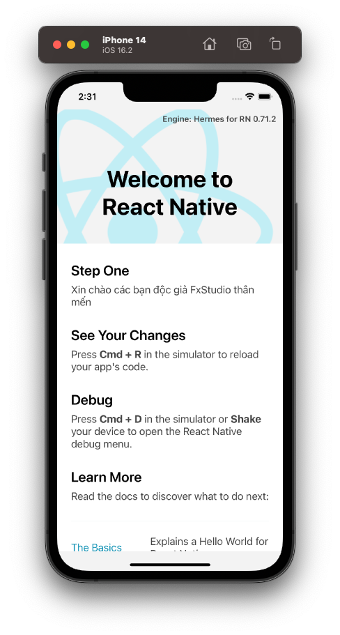

# 002 - Component
Tiếp tục, chúng ta khám về khái niệm lớn **Component** trong **React Native**.

## Khái niệm

Ta có định nghĩa cho Component như sau:

> *Trên giao diện một màn hình ứng dụng, chúng ta chia nhỏ những phần giao diện có đặc điểm giống nhau thành một block, và gọi block này là component.*

Đây là một khái niệm quan trọng trong React Native. Nó vừa là thành phần cốt lõi, vừa ảnh hưởng toàn bộ lên UI ứng dụng. Chúng có thể lồng nhau và tái sử dụng cao. Cũng nhờ đó, chúng ta sẽ sử dụng được nhiều component được tích hợp sẵn vào trong core.

Có 2 đặc tính quan trong của một Component:

* **Đóng gói**: 
  * Mọi xử lý liên quan tới logic của UI sẽ đóng gói trong **component**. 
  * Một component chỉ nhận dữ liệu qua **props**, sau đó xử lý và trả kết quả là UI ra màn hình. 
  * Tóm lại, mọi tác nhân bên ngoài không làm ảnh hưởng tới kết quả **render UI**,ngoại trừ dữ liệu mà bạn truyền vào cho **component** thông qua **props**.
* **Tái sử dụng**: 
  * Chính vì tính đóng gói mà các **component** có thể tái sử dụng ở bất kỳ đâu. 
  * Nhờ đó mỗi khi cần thay đổi UI, bạn chỉ cập nhật một lần *code* của **component** là tất cả mọi nơi được thay đổi theo.

Lấy cái màn hình ví dụng kinh điển mỗi khi `init` project. Cấu trúc phân tầng các Component trong ứng dụng như sau:

```
App component 
|___Header component 
|___Section component 
|     |___View 
|     |     |___Text
```



* Viết code 1 lần và tái sử dụng ở nhiều nơi
* Component lồng trong Component khác thì gọi là Component con.
* Component mà đang bọc component con đó sẽ được gọi component cha

## Vòng đời của Component

Chúng ta đi vào phân tích xem vòng đời của 1 Component sẽ như thế nào. Ta có hình mô tả như sau:


Trong đó:

* **Mounting**: Trong giai đoạn này, component sẽ được khởi tạo và thêm vào bộ nhớ. Các hàm trong giai đoạn này gồm:

  * `Constructor()`
  * `render()`
  * `ComponentDidMount()`

* **Updating**: Ở giai đoạn này, bạn hiểu là component đã được tạo xong và đang chạy. Nó có thể lắng nghe, và cập nhật các thay đổi. Ví dụ như khi state thay đổi chẳng hạn (khái niệm State chúng ta sẽ tìm hiểu ở phần sau cuốn sách). Các hàm trong giai đoạn này gồm:

  * `shouldComponentUpdate()`
  * `getSnapshotBeforeUpdate()`
  * `componentDidUpdate()`

* **Unmounting**: Ở giai đoạn này, component sẽ được xóa khỏi bộ nhớ. Trước khi nó thực sự xóa khỏi bộ nhớ, component sẽ gọi hàm `componentWillUnmount()` để bạn có thể chủ động dọn dẹp, như hủy timers, hủy các network requests, unsubscribe các sự kiện,v.v... trước khi component “tan biến”.

  * `componentWillUnmount()`

* **Error Handling**: Bất cứ khi nào có lỗi xảy ra trong quá trình
render component, thì các hàm trong giai đoạn này sẽ được gọi, và bạn có thể xử lý lỗi trong đó. Các hàm trong giai đoạn này bao gồm:

  * `static getDerivedStateFromError()` 
  * `componentDidCatch()`

> Như vậy là tạm thời okay vòng đời của Component rồi nhóe!

## Props

Đây là viết tắt của  **Properties** (thuộc tính). Nhưng bên React Native thì nó lại hơi giống **attribute** của HTML hơn. Các props là các thuộc tính của một Component, nó có nhiệm vụ nhận dữ liệu từ bên ngoài truyền vào cho Component.

Trong các ví dụ project Hello thì bạn có thể nó ở Component Section (trong file `App.tsx` nhóe).

```react
<Section title="Step One">
    Xin chào các bạn độc giả FxStudio thân mến
</Section>

```

Bạn sẽ thấy rằng:

* Giá trị của `title` được truyền từ ngoài vào cho Component Section
* Muốn thay đổi giải trị thì chúng ta có thể truyền giá trị khác

Ngoài ra, bạn sẽ còn một cách nữa là viết functional component, nó tương tự như function & object ở các ngôn ngữ lập trình khác. Lúc này, các props là các tham số trong function.

> Chúng ta sẽ tìm hiểu sau nhóe!

## State

**State** là loại dữ liệu tiếp theo tác động được lên Component. Với ý tưởng là mỗi component đều mang trong mình “trạng thái” (State), khi trạng thái thay đổi, giao diện được render lại theo trạng thái đó.

> Giống với State ở SwiftUI

Đặc trưng:

* Giúp Component tự động cập nhật lại
* Binding 2 chiều

Còn đây là một ví dụ code khá đơn giản về áp dụng State nhóe.

```js
const NewApp = () => {

    const [count, setCount] = useState(0);

  return (
    <View
            style={{
                flex: 1,
                justifyContent: 'center',
                alignItems: 'center'
            }}>
            <TouchableOpacity
                style={{
                    alignItems: 'center',
                    backgroundColor: '#DDDDDD',
                    padding: 10,
                    marginBottom: 10,
                }}
                onPress={ ()=> setCount(count + 1) }>
                <Text>Tap me!</Text>
      </TouchableOpacity>
            <View>
                <Text>You tapped {count} times.</Text>
      </View>
    </View>
  );
};
```

Nội dung của đoạn code là đếm số lần click vào Button mà thôi. Chi tiết code sau thì chúng ta tìm hiểu sau nhóe. Bạn cần chú ý 2 điểm là:

* Việc hiển thị chỉ cần trỏ tới biến State
* Việc thay đổi giá trị State chỉ là thay đổi giá trị, không cần quan tâm tới phải xét lại UI

## Passing Data

Mối quan tâm tiếp theo nữa mà bạn cần giải quyết là việc truyền dữ liệu. Ở các nền tảng native (iOS & Android) ta sẽ cần truyền dữ liệu giữa các màn hình hay objects. Còn với React Native chính là các Component.

### Cha sang Con

Đây là chiều đầu tiên và là đơn giản nhất. Ta chỉ cần tạo ra các parameter và truyền thôi.

> Bạn cần nắm được cách tạo một Component với tham số cho props

* **Component Con**

```js
const ChildComponent = ({counter}: {counter: number}) => {
    return (
        <View>
            <Text style={{ color: "#000000", fontWeight: "bold", fontSize: 40, }}>Bộ đếm {counter}</Text>
        </View>
    )    
};
```

* **Component Cha**

```js
const NewApp2 = () => {

    const [count, setCount] = useState(0);

    return (
        <View style={styles.containerView}>
            <TouchableOpacity
                style={{
                    alignItems: 'center',
                    backgroundColor: '#DDDDDD',
                    padding: 10,
                    marginBottom: 10,
                }}
                onPress={ ()=> setCount(count + 1) }>
                <Text>Tap me!</Text>
            </TouchableOpacity>
            <ChildComponent counter={count}></ChildComponent>
        </View>
  );
};
```

Biến `count` từ Component Cha, gán giá trị đó cho tham số `counter` của Component Con.

### Con sang Cha

Chiều ngược lại thì chúng ta sử dụng `callback` hoặc `emit` một Event. Cũng lại là khá giống với.

> Về bản chất cũng giống như bao ngôn ngữ khác có Callback.

Nguyên tắc:

* Định nghĩa function callback ở CHA
* Đăng ký function đó từ CHA cho CON
* Chú ý về mặt khai báo tham số và giá trị trả về
* Tại CON, khi có sự thay đổi nào cần báo lại CHA thì sử dụng con trỏ đã trỏ tới function callback ở cha

Ví dụ xem qua khai báo CON trước nha:

```js
const ChildComponent = ({counter, parentCallback}) => {

    const [text, onChangeText] = useState("");

    // call back
    const send = () => { parentCallback(text); }

    return (
        <View style={styles.childView}>
            <Text style={{ color: "#000000", fontWeight: "bold", fontSize: 20, }}>Bộ đếm {counter}</Text>
            <Text style={{ color: "red",fontSize: 20, }}>Gửi cho Cha già</Text>
            <TextInput value={text} placeholder="nhập vào đi" onChangeText={onChangeText} style={styles.textInput}/>
            <TouchableOpacity style={styles.buttonSend} onPress={send}>
                <Text style={{ color: "white"}}>Gửi</Text>
            </TouchableOpacity>
        </View>
    )    
};

```

Trong đó:

* Thêm một TextInput để lấy giá trị người dùng nhập vào. Sau đó, xét cho biến `text`
* Khai báo một function `send` cho sự kiện `onPress` của Component Button trong con

Tại CHA ta cũng cần thêm một số code nữa.
```js
const NewApp2 = () => {

    const [count, setCount] = useState(0);
    
    // call back
    const [childrendContent, setChildrendContent] = useState(`Món quà từ con`);
    const callbackFunction = (childData) => { setChildrendContent(childData) }

    return (
        <View style={styles.containerView}>
            <Text style={{ color: "green", fontWeight: "bold", fontSize: 15, }}>Dữ liệu từ con: {childrendContent}</Text>
            <TouchableOpacity
                style={{
                    alignItems: 'center',
                    backgroundColor: '#DDDDDD',
                    padding: 10,
                    marginBottom: 10,
                }}
                onPress={ ()=> setCount(count + 1) }>
                <Text>Tap me!</Text>
            </TouchableOpacity>
            <ChildComponent counter={count} parentCallback={callbackFunction}></ChildComponent>
        </View>
  );
};
```

Trong đó:

* `childrendContent` dùng để nhận dữ liệu từ con về và dùng để cập nhật cho Text
* `callbackFunction` dùng là hàm để nhận sự kiện từ lớp Con trả về

### Global Store

Khi chúng ta có quá nhiều cấp cho các Components lồng nhau. Để truyền dữ liệu qua nhiều cấp như vậy ta có thể sử dụng tới một kho dùng chung (Global Store). Từ kho đó, ta tiến hành truy xuất hoặc đọc ghi dữ liệu.

> Để quản lý kho đó, ta sử dụng React Redux

Vấn đề quan trọng của kho, chính là khả năng UI sẽ phản hồi lại tự động khi có sự thay đổi giá trị dữ liệu. Và chúng ta sẽ tìm hiểu sau nhóe

### Giữa các Components ở các Màn hình khác nhau

Vấn đề này được giải quyết với React Navigation. Cũng là tìm hiểu sau.

## Events

Phần tiếp theo mà bạn cần nắm đó là các sự kiện mà người dùng tương tác lên các Component. Ví dụ như chạm vào, gõ chữ ... Tất cả các sự kiện đó đều là các `props` của Componets. Ví dụ:

```js
<TouchableOpacity style={styles.buttonSend} onPress={send}>
   	<Text style={{ color: "white"}}>Gửi</Text>
</TouchableOpacity>
```

Thì `onPress` là sự kiện nhấn vào Button. Bạn cần truyền cho nó 1 thám số với kiểu là `function` hoặc bạn có thể viết luôn các dòng lệnh xử lý vào đó dưới dạng `arrow function`. Cũng khá đơn giản nhỉ.

## Khai báo Components

Cũng hơi ngược đường ngược lối khi phần này lại đặt ở cuối. Ta sẽ có 2 cách khai báo 1 Components (khác với cách khai báo ở trên nhóe).

### Class component

Để tạo một component, chúng ta sẽ tạo một class kế thừa từ class `React.Component`. Với cách viết này, chúng ta sẽ cần hàm khởi tạo `constructor()`, và các hàm trong vòng đời của component như:

* `componentDidMount()`
* `componentDidUpdate()`
* `componentWillUnmount()`

Ví dụ code:

```js
import React, { Component } from 'react'; 
import { Text } from 'react-native';

class MyComponent extends Component {
  render() {
    return (
      <Text> Ahihi!</Text>
	);
	} 
}

export default MyComponent;
```

Trong đó, `render()` là một hàm đặc biệt, nó sẽ luôn luôn hiển thị một Text. Và chúng ta lại viết các React Element trong phần `return` của nó. 

Còn đây là ví dụ đầy đủ khi chúng ta triển khai các function khác của một Component luôn nhóe.

```js
import React, { Component } from "react";
import { Text } from "react-native";

class MyComponent extends Component {

    // constructor
    constructor(props) {
        super(props);
        this.state = {
            name : props.name,
        }
    };

    // life cycle
    componentDidMount() {
        console.log("MyComponent -> componentDidMount");
    }

    componentDidUpdate(prevProps){
        console.log("MyComponent -> componentDidUpdate");
    }

    componentWillUnmount() {
        console.log("MyComponent -> componentWillUnmount");
    }

    // render
    render(){
        return(<Text>Xin chào, {this.state.name}</Text>);
    }
}

export default MyComponent;
```

Trong đó:

* Tại `constructor()` bạn sẽ khai báo với tham số `props` và phải gọi `super(props` để nó lấy được các thuộc tính từ Components cha nhóe
* Kèm theo đó ta khai báo các `state` cần dùng cho Component
* `render()` chịu trách nhiệm hiển thị

Sử dụng ở Component cha như sau:

```js
<View style={styles.containerView}>
	...
   	<MyComponent name={"ABC"}/>
   	...
</View>
```

### Functional component

**Functional component** là một hàm Javascript trả về 1 React element. Một function component được định nghĩa đúng sẽ gồm 3 yếu tố:

* Là một function Javascript / ES6 function
* Phải trả về 1 React element.
* Nhận props làm tham số nếu cần.

Ví dụ cũng tương tự các phần ở trên thôi

```js
import React from 'react';
import { View, Text, StyleSheet, DeviceEventEmitter} from 'react-native';

const MyComponent = (props) => {
  return (
    <Text>Ahihi!</Text>
  )
}

export default MyComponent;
```

Ở trên, là cách viết gọn thôi với cú pháp Arrow Function. Còn về nguyên bản thì như sau:

```js
function Welcome(props) {
    return(
      <Text>Hello, {props.name}</Text>  
    );
}
```

Quen thuộc phải không nào. Các thanh niên mới học đỡ bất ngờ. Còn triệu hồi nó trong Component cha như sau:

```js
<View style={styles.containerView}>
	...
  	<MyComponent name={"ABC"}/>
  	<Welcome name={"ABC2"} />
  	...
</View>
```

## React Hooks

Sự khác nhau cơ bản giữa **Class Component** & **Functional Component** chính là việc theo dõi các sự kiện trong **life cycle** của nó. Với class, mọi thứ rất dễ dàng, còn Function thì không. Ngay cả các `state` cũng không xử lý được. Do đó, theo một xu thế tất yếu thì **React Hooks** ra đời.

> Tham khảo chính tại [Hooks API Reference](https://reactjs.org/docs/hooks-reference.html) nhóe!

Ta sẽ tìm hiểu sơ qua 3 cái chính thôi.

### useState Hook

`useState()` thì quen rồi, ghi rất nhiều ở trên. Nó là Hook giúp bạn có thể sử dụng **state** trong một functional component.

Cú pháp như sau:

```js
const [state, setState] = useState(initialState);
```

Trong đó:

* Đối số truyền vào cho `useState` sẽ là giá trị cho biến `state`
* Một mãng gồm 2 phần tử. 1 cái là tên state, 1 cái là hàm cập nhật cho state

Bạn cũng không cần phải định nghĩa các state ở khai báo. Chúng nó cũng `binding` xịn sò nữa.

### useEffect Hook

`useEffect` cung cấp cho bạn các hàm/công cụ (khó gọi tên quá) để quản lý life-cycle của Component.

Cú pháp tổng quan của `useEffect` hook như sau:

```js
useEffect(() => {
    // ComponentDidMount
    return () => {
        // ComponentWillUnMount
} }, [
    // ComponentDidUpdate
])
```
Phân tích một chút nhóe!

#### ComponentDidMount()

```js
useEffect(() => {
    // Bạn viết code xử lý logic tại đây
}, []);
```

* Được gọi 1 lần khi Component được mounted
* tham số thứ 2: "[ ]" là một array rỗng. Nó xác định đoạn code bên trong hàm useEffect() chỉ chạy đúng một lần.

#### ComponentDidUpdate()

```js
useEffect(() => {
    // Bạn viết code xử lý logic tại đây
    });	
```

* Không sử dụng tham số thứ 2
* Đoạn code bên trong sẽ chạy mỗi khi Component được render

Nó giống với hàm `componentDidUpdate()` của Class Component.

#### ComponentWillUnMount()

```js
useEffect(() => {
	// hàm được trả về sẽ được gọi khi component unmount
    return () => {
      // Bạn viết code xử lý logic tại đây khi component unmount.
	} 
}, [])
```

* Hàm dùng để `return` về sẽ có tác dụng giống như `componentWillUnMount()`
* Hàm sẽ được gọi khi Component được unmount

#### monitor states

Khi muốn theo dõi các biến State thì có thể dùng cú pháp sau:

```js
useEffect(() => {
	// hàm trong này sẽ được gọi khi một trong các state1, state2 thay đổi giá trị.
}, [state1, state2,...]);
```

> Có cơ hội sẽ tìm hiểu sau. Tạm thời thế đã!

### useRef Hook

**useRef (giá trị khởi tạo)** hook nhận giá trị khởi tạo ban đầu và trả về một tham chiếu *(tiếng anh gọi là Reference)* hoặc một đối tượng tham chiếu. Tham chiếu là một object đặc biệt có 1 thuộc tính là **current**: `reference.current`

Có 2 điều cần nhớ về useRef là:

* Giá trị của reference sẽ được giữ nguyên khi **component re-ender**
* Việc cập nhật **reference** sẽ không làm cho **component re-render**

Đọc đến đây hẳn bạn sẽ liên tưởng rằng `useRef()` hook khá giống với việc sử dụng **state** để lưu trữ dữ liệu. Tuy nhiên, có hai điểm khác khác nhau cơ bản giữa `useRef()` và **state** đó là:

* Khi set giá trị cho **state** thì compo****nent sẽ bị **render** lại để cập nhật UI, trong khi `useRef()` thì không.
* Điểm khác thứ hai là khi state update sẽ chạy bất đồng bộ, còn với `useRef()` sẽ update ngay lập tức vì được chạy đồng bộ.

Sử dụng `useRef()` là để tạo tham chiếu cho các components con, từ đó mình có thể gọi được hàm trong component con đó từ component cha.

Hiện tại thì nhà phát triển đang rất tập trung và khuyến khích bạn sử dụng function component kết hợp với hook thay vì sử dụng class component.

## Tạm kết

> Tới đây, chúng ta xem như tạm kết thúc về cơ bản với các Components trong React Native nhóe!

---

*(Chúc bạn một ngày tốt lành và cảm ơn bạn đã ghé thăm repo này.)*
