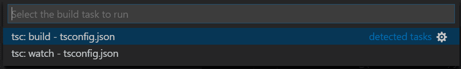

# TypeScript - Hello world!

Bạn sẽ bắt đầu tìm hiểu về **TypeScript** bằng việc **Hello world** nó. Giúp bạn biết được cách một chương trình **TypeScript** sẽ chạy như thế nào. Và cách cài đặt môi trường cơ bản ban đầu cho nó.

## Cài đặt

### NodeJS

Đầu tiên, bạn cần cài đặt **NodeJS** cho máy tính của bạn trước nha. Nếu bạn chưa biết thì tham khảo nhóe!

**Bước 1**: Cài đặt **Homebrew**

```sh
/usr/bin/ruby -e “$(curl -fsSL https://raw.githubusercontent.com/Homebrew/install/master/install)"
```

**Bước 2**: Cài đặt **NodeJS**

```sh
brew install node
```

### Typescript

Okay, ta tiến hành cài đặt **Typescript** thông qua lệnh sau nhóe.

```sh
npm install –g typescript
```

Để cho ăn chắc, thì bạn có thể sử dụng các lệnh `tsc` để kiểm tra rằng **Typescript** đã được cài đặt ổn hay chưa.

```sh
tsc --version
tsc --help
```

Các file **Typescript** sử dụng đuôi mở rộng là `*.ts` & `*.tsx` (con bà **tsx** thì mình chưa tìm hiểu nên tạm bỏ vào vậy nhóe).

> Phiên bản mà mình sử dụng cho bài viết là `5.0.2` nhóe!

### Editor

Bạn có thể sử dụng vô số các **editor** để tiến hành *coding* với **Typescript**. Với mình thì sự lựa chọn ổn nhất hiện tại là **Visual Studio Code** nhóe. Cứ thế mà quất cho chắc nha bạn.

## Hello world

Đầu tiên, bạn cần tạo 1 thư mục để chưa file chương trình đầu tiên của chúng ta.

> Con bà này rắc rối lắm, nó sẽ sinh ra nhiều file linh tinh nên gom về 1 thư mục trước đã.

Sử dụng, **VS Code** mở thư mục lên và tạo 1 file *Typescript* nhóe. Mình đặt tên là `example.ts` và đây là *code* của nó.

```ts
console.log('Hello word');

var temp: number;
temp = 10;

console.log(temp);

var str = 'Fx Studio';
console.log('Hello, ' + str);
```

Cũng không có gì khó trong này à. Bạn sẽ có 2 cách để thực thi file đó.

1. Chạy **chay**, tức là không sử dụng module
2. Chạy với **file** `config` của project

### Run Without Module

Trước tiên, bạn cần biên dịch file *Typescript* thành file **Javascript** trước nhóe. Sử dụng lênh sau:

```sh
tsc example.ts
```

Trong đó, `example.ts` là tên file **TypeScript** của bạn. Kết quả là bạn có thêm một file `example.js` là file **Javascript**.

Tự động dịch nếu nội dung file thay đổi.

```sh
tsc example.ts --watch
```

Phần chính là bạn sẽ dùng **NodeJS** thực thi file **JS** vừa sinh ra nhóe. Sử dụng lệnh sau:

```sh
node example.js
```

Kết quả sẽ xuất hiện luôn ở *Terminal* nhóe!

> Bạn sẽ thấy mối quan hệ giữa **Typescript** và **Javascript** rồi đấy. Mọi thứ chỉ vậy thôi, đơn giản hè!

### Run with config file

Tất nhiên, cách trên dùng để biết bản chất thực thi của **TS** mà thôi. Vì bạn sẽ dùng **TS** trong các project *React, React Native ...* đủ thứ trên đời. Nên cần phải **build** hay **run** hay debug trên *Editor*. Mục đích, bạn sẽ cần thêm nhiều thông tin hơn nữa lúc bạn thực thi, ví dụ như lỗi ở đâu để còn xóa.

#### tsconfig.json

Bạn có thể có nhiều cách tạo file đó. Nó tên là `tsconfig.json`, là một file **JSON** nên tạo cách nào cũng được. Bạn có thể dùng **VS Code** tạo trực tiếp trên thư mục chứa file **TS** kia. Hoặc sử dụng **Terminal** để tạo luôn cũng được. Xem lệnh sau:

```js
tsc --init
```

Kết quả bạn sẽ có 1 file `tsconfig.json` với rất nhiều dòng *comments* trong đấy. Tìm hiểu sau nhóe. Nhưng mà cơ bản thì như sau:

```json
{
  "compilerOptions": {
    "target": "ES6",
    "module": "commonjs",
    "outDir": "out",
    "sourceMap": true
  }
}
```

Trong đó:

* **target** sẽ chỉ định bạn sử dụng phiên bản cú pháp nào. Ta dùng **ES6** là an toàn nhất
* **module** với `commonjs`
* **outDir** là thư mục `out` để mấy file sinh ra trong quá trình biên dịch sẽ vào đó. Làm gọn project
* **sourceMap** với giá trị là `true` sẽ giúp bạn de-bug trong quá trình thực thi

#### Run the TypeScript build

Để có thể thực thi **TS** với **module & config file** thì bạn cần có một file trung gian giữa **TS & JS**. Bạn sẽ tạo ra chúng bằng lựa chọn **build task** từ **VS Code** nha. Nó tương tự với việc sử dụng `tsc` mà thôi.

Tại *menu VS Code*, bạn chọn *Terminal > Run Build Task*. Và lựa chọn thôi



* Cái trên dùng để build ra **JS** file
* Cái dưới dùng để tự động theo dõi thay đổi của **TS** để build luôn **JS**

Kết quả của bước này là bạn sẽ trong thư mục `out` trong thư mục project. Sẽ xuất hiện 2 file `example.js` & `example.js.map`

#### Run

Mọi thứ đã ổn rồi, thì bạn hay chọn file **Typescript** của bạn. Bấm **F5** mà xem kết quả ở tab **Console** trong **VS Code** nhóe. EZ Game!

> Cũng khá là vòng vèo với H**ello world** rồi. Chúng ta sẽ tìm hiểu Typescript có gì nào.


## Ghi chú

> *Chưa có gì hết. Ahihi!*

---

*(Chúc bạn một ngày tốt lành và cảm ơn bạn đã ghé thăm repo này.)*