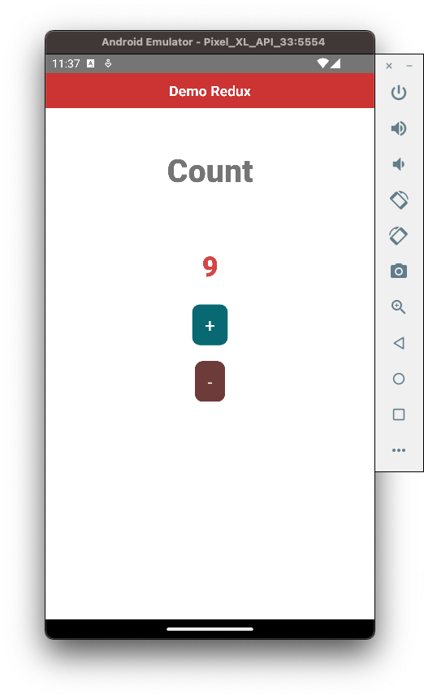

# React Redux

Ở các phần trước, bạn đã sử dụng **State** thông qua việc sử dụng `useState` hook rồi. Tuy nhiên, chúng ta còn có nhiều trường hợp với độ phức tạp cao hơn thì sẽ cần tới *một cách/thư viện/kiến trúc ... (tuỳ tên mà bạn có thể hiểu và có thể gọi)* để quản lý dữ liệu ở mức độ cao hơn. Trong vũ trụ **React Native** thì cái tên **Redux** là phổ biến nhất. Chúng ta tiếp tục tìm hiểu nào.

> Bắt đầu thôi!

## Redux là gì?

> Redux is a pattern and library for managing and updating application state, using events called "actions"

* **Redux** là một công cụ quản lý **state**
* Các **state** của ứng dụng được giữ trong một **store** và các **component** đều có thể truy cập vào *store* này để lấy *state*
* Là một thư viện **JavaScript**, chứ không phải chỉ dành cho mỗi *React Native* nhoé.

Cũng khá tương đồng với **The single source of truth** của *SwiftUI*. Có thể đây là xu thế mới cho 2~3 thập kỷ lập trình tiếp theo.

Tìm hiểu khái niệm vậy là đủ rồi. Chúng ta tiếp tục xem có gì trong đó.

## Nguyên lý hoạt động

Có 3 nguyên lý cơ bản như sau:

* **Single store**: 
	* Nguyên tắc đầu tiên của *Redux* là tất cả các **state** được chứa trong một **store** duy nhất
	* *Store* này thường là một **Object**.

* **Immutable**: 
	* **State** của ứng dụng là bất biến *(Immutable)*. 
	* Điều này có nghĩa là *Object* để lưu trữ state không cho phép chỉnh sửa, cập nhật dữ liệu trực tiếp từ bất kỳ *component* nào. 
	* Để cập nhật *state* trong *store* từ các *component*, chúng ta bắt buộc phải tuân theo quy trình của **Redux**, đó là gửi các **actions** và để các **reducer function** cập nhật *state*.

* **Pure functions**: 
	* Tất cả các *functions* để cập nhật hay tạo mới **state** *(Redux gọi các function này là reducer)* phải là các **pure function**. 
	* *Pure function* là một hàm mà khi các *params* đầu vào không thay đổi thì kết quả return luôn luôn không thay đổi, dù hàm đó có thực thi bao nhiêu lần đi chăng nữa.

## Thành phần


*(Hình mình hoạ thôi nha!)*

### Store

**Store** là một object lưu trữ tất cả State của ứng dụng. Nó được tạo thông qua các `reducer`. Ta sử dụng hàm `createStore()` để tạo mới một store. Ví dụ đại khái như sau:

```js
const store = createStore(abcd);
```

Về mặt ứng dụng, các thành phần khác có thể: *cho phép truy cập state qua getState(), update state qua dispatch(action), đăng kí listener qua subscribe(listener)... (tìm hiểu sau)* Và chúng ta nên tạo ra duy nhất 1 Store thôi nhóe.

### Action

Là cách mà ta sẽ mô tả hành động của ta mong muốn làm gì với Store nhóe. Chúng có có 2 phần:

* **Type**: 
	* Mô tả loại **Action** thực hiện.
	* Nên định nghĩa chúng là các **Type** riêng lẻ, tránh trùng nhau
* **Value**:
	* Hay còn gọi là giá trị tham số
	* Được định nghĩa vào trong **payload**
	
Ví dụ code đơn giản.

```js
const setUser = (user) => {
  return {
    type: "LOGIN",
    payload: {
     username : user.name,
     password : user.password
    }
  } 
}
```

> Tạm thời chấp nhận như vậy đi, để tìm hiểu tới xem sao.

### Reducers

Đây là thành phần chịu trách nhiệm thay đổi giá trị State được lưu trong Store. **Reducer** nhận 2 tham số: 

* **state** cũ và thông tin action được gửi lên
* sau đó nó biến đổi trả ra một **state** mới, không làm thay đổi **state** cũ.

Việc không làm thay đổi **state cũ** thì các *Reducers* phải là các **Pure Function**. Ví dụ không cần hiểu như sau:

```js
const initialState = {
  username: '',
  password: ''
};

const loggeduser = (state = initialState, action) => {
    switch (action.type) {
      case "LOGIN":
			return {
			           username : action.payload.username,
			           password : action.payload.password
			}; 
		default:
			return state;
	 }
};
```
Vẫn như trên, ta tiếp tục khám phá tiếp. Chứ tới đây chỉ là lý thuyết mờ hồ mà thôi.

### Views

Thì cũng hơi thừa khi liệt kê vào. Nhưng các Views đóng vài trò hiển thị giá trí của các State. Và chúng nó tự động thay đổi theo khi có sự thay đổi từ State. Đơn giản vậy thôi.

## Cài đặt

Em Redux này cũng là 1 dependencies như bao dependencies khác. Do đó, muốn sử dụng thì bạn phải cài đặt nhóe. Chạy các lệnh sau nha:

```shell
npm install redux

npm install react-redux
```

## Cấu hình files ban đầu cho dự án

### Home Screen

```js
const HomeScreen = () => {
  const handleIncreament = () => {
    console.log('Tăng điểm');
  };

  const handleDecreament = () => {
    console.log('Giảm điểm');
  };

  return (
    <View style={{flex: 1}}>
      <View style={{alignItems: 'center', backgroundColor: '#cc3333', padding: 10}}>
        <Text style={styles.textHeader}>Demo Redux</Text>
      </View>

      <View style={styles.container}>
        <Text style={styles.title_text}>Count</Text>
        <Text style={styles.counter_text}>0</Text>

        <TouchableOpacity onPress={handleIncreament} style={styles.btn}>
          <Text style={styles.btn_text}> + </Text>
        </TouchableOpacity>

        <TouchableOpacity
          onPress={handleDecreament}
          style={{...styles.btn, backgroundColor: '#6e3b3b'}}>
          <Text style={styles.btn_text}> - </Text>
        </TouchableOpacity>
      </View>
    </View>
  );
};
```

Tạm thời, bạn xem qua code cho giao hiện và xử lý sự kiện cho 2 button trước. Phần logic, chúng ta sẽ triển khai sau.

### App

```js
import React from 'react';
import HomeScreen from './screens/HomeScreen';

export default function App() {
  return <HomeScreen />;
}
```

Trong đó:

* Viết lại cho nó dé chút
* Thêm màn hình Home chính là màn hình ban đầu cho App

## Cấu hình cho Redux

Cũng hơp phực tạp, ta tiến hành tạo các thư mục và các files sau nha. Để cho dễ quản lý, bạn hãy tạo thêm các thư mục phục vụ cho Redux bên trong project của bạn nhóe. Ví dụ tham khảo của mình như sau:

```
src
  ...
  |---redux
          |---actions
                    |---countAction.js
          |---reducers
                    |---countReducer.js
          |---store.js
   ...
```

Vì sau này, logic càng phức tạp thì số lượng file càng nhiều. Do đó, bạn có một cách quản lý quy hoạch ngay từ đầu thì vẫn oke hơn nhiều nhóe.

### Actions

Đầu tiên, bạn sẽ định nghĩa các Actions mà bạn cần dùng cho chức năng. Theo ví dụ, ta có 2 actions như sau:

```js
export const increment = () => {
    return {
        type: 'INCRESE',
    };
};

export const decrement = () => {
    return {
        type: 'DECRESE',
    }
};
```

Bạn tạo một file tệ là `countAction.js` và đặt theo cây thư mục trên nhóe. Có nhiều cách khác nhau mà bạn định nghĩa kiểu cho action. Nhưng về chung quy bạn cần có:

* 1 function trả về 1 object
* Đối tượng trả về có kiểu quy định cho action thì khai báo trong key `type`

### Reducers

Đây là nơi bạn sẽ tập trung xử lý logic liên quan tới giá trị lưu ở `store` nhóe. Đầu tiên, bạn tạo một file `countReducer.js` và đặt trong đúng thư mục theo cây ở trên.

* Khai báo giá trị ban đầu

```js
const initialState = {
    count: 0,
};
```

* Xử lý các actions

```js
export default (state = initialState, action) => {
    switch (action.type) {
        case 'INCRESE':
            return {
                ...state,
                count: state.count + 1,
            };
        case 'DECRESE':
            return {
                ...state,
                count: state.count - 1.
            };
        default:
            return state;
    }
};

```

Đơn giản, ta dựa vào `type` để xác định đúng action mình xử lý. Với 2 trường hợp:

* Trả về trạng thái mới với giá trị mới, nếu đúng kiểu cho action
* Trả về trạng thái cũ, nếu không đúng kiểu action

Dấu `...` là **Spread operator** và nó đang được sử dụng với kiểu dữ liệu là **Object**. Ý nghĩa cho code trên:

* `...state` : lấy đối tượng state để sử dụng
* `count` : gán giá trị mới cho `count`

> Với ví dụ code kiểu này thì tập trung xử lý dữ liệu lưu trữ ở `state` hay cái `initialState`. Còn một số trường phái khác thì dữ liệu sẽ được gửi kèm vào trong `action`. Lúc này bạn chỉ cần thực hiện việc gán dữ liệu mới từ `action` cho `state` thôi. Móa, phức tạp vãi cả ra. [Đây](https://blog.haposoft.com/tich-hop-redux-reactnative/) là ví dụ có cách thứ 2 nè.

### Store

Chừ mới tới phần chính của chúng ta, đó là Store trong Redux. Bạn tiếp tục tạo file với tên là `store.js` và đặt đúng theo mô tả cây thư mục ở trên nhóe.

Theo dõi đoạn code sau:

```js
import { legacy_createStore as createStore, combineReducers } from "redux";
import countReducer from "./reducers/countReducer";

const rootReducer = combineReducers({
    count: countReducer,
});

export const store = createStore(rootReducer);
```

Trong đó:

* `rootReducer` mang nhiệm vụ hợp nhất các Reducer lại với nhau. Có thể bạn sử dụng nhiều Reducer cho sau này.
*  Hàm `combineReducers` dùng thự hiện vụ hợp nhất
*  `store` tạo ra bởi Reducer hợp nhất ở trên bằng việc sử dụng hàm `createStore()`

> Sử dụng `legacy_createStore` vì React Redux đã khai tử `createStore` rồi. Bạn tìm hiểu cho biết thôi, sau này sẽ sử dụng nhiều cái tân tiến hơn.

Như vậy, là tạm ổn cho bước cài đặt Redux rồi nhóe.

## Sử dụng

Bước cuối cùng là bạn sử dụng **Redux** vào trong ứng dụng nha. Phần này tập trung xử lý ở **View** hay **Component** là chính thôi.

### Cài đặt cho App

Vì ta sẽ sử dụng Redux cho toàn bộ chương trình, nên phải thêm 1 bước khai báo và cấu hình cho toàn bộ chương trình nữa. Bạn vào file `App` nhóe. Chỉnh sửa lại như sau.

```js
import React from 'react';
import { Provider } from 'react-redux';
import { store } from './redux/store';
import HomeScreen from './screens/HomeScreen';

export default function App() {
  return(
    <Provider store={store}>
      <HomeScreen />
    </Provider>
  );
}
```

Bạn chỉ cần quan tâm tới **Provider** là đủ. Trong đó, Provider là:

* Là một **component** trong React Redux cung cấp
* Giúp mình có thể **truy cập và sử dụng** Store trong Redux
* Thường sẽ sử dụng nó ở **top level** trong cây component
* Hook & API cũng có thể **kết nối** tới store thông qua Provider

### View

Tiếp theo, bạn tích hợp Redux vào các màn hình, view ... mà bạn sẽ sử dụng. Ta đang áp dụng chúng cho màn hình `HomeScreen` nhóe. Ta sẽ thêm các khai báo ban đầu vào.

```js
const HomeScreen = () => {

  ...
  
  const dispatch = useDispatch();
  const count = useSelector((store) => store.count.count);
  
  ...
}
```

Trong đó:

* `dispatch` chính là đối tượng giúp bạn truyền `action` đi tới cho Reducer
* `count` là trạng thái *(state)* chính mà mình muốn sử dụng của `store`. Nó sẽ theo dõi sự thay đổi giá trị từ store.

Bạn sẽ dử dụng 2 hook là `useDispatch()` & `useSelector()`. Do đó, cần import đúng thư viện nha

```js
import { useDispatch, useSelector } from 'react-redux';
```

Cụ thể chúng nó là:

* `useSelector`: Giúp truy xuất vào store để lấy **state**.
* `useDispatch`: Giúp gửi **action** để kích hoạt thay đổi **state**

> **Dispatcher** là cái phần nó quản lý **middleware**, thường dùng để gọi *API, log, vv... *. Phần này phức tạp vãi cả ra, nên tìm hiểu sau nha. 

Tiếp theo, bạn cập nhật việc sử lý logic nha.

```js
  const handleIncreament = () => {
    dispatch(increment());
  };

  const handleDecreament = () => {
    dispatch(decrement());
  };
```

Tại các function ở View, bạn dùng `dispatch` để gọi các `action`. Hết, đơn giản vậy thôi. Còn việc hiển thị dữ liệu thì ta đã sử dụng State cho biến `count` khai báo ở trên rồi. Công việc cuối cùng là bạn nhét nó vào View nào mà bạn mong muốn. Ví dụ:

```js
<View style={styles.container}>

	...
	
   <Text style={styles.title_text}>Count</Text>
   <Text style={styles.counter_text}>{count}</Text>
   
	...
	
</View>
```

Save hoặc Reload lại để xem sự thay đổi nhóe. Chúc bạn thành công, ahihi!




## Tóm tắt

Để bạn khỏi phải rối não thì ta có thể tóm tắt như sau:

> Action -> Reducer -> Store -> View

* **Redux** sử dụng kiến trúc 1 chiều, tức là nó có flow như bên trên, chỉ vòng vòng 1 chiều như vậy.
* **State** của toàn bộ ứng dụng được lưu trong trong 1 store duy nhất là 1 Object mô hình tree: *Single source of truth*. Chúng không thể thay đổi trực tiếp được.
* **Action** là một đối tượng (object) của JS, với key cần có là `type` sẽ mô tả kiểu của nó. Phần dữ liệu còn lại sẽ ở trong `payload` hoặc các thuộc tính tiếp theo của chính nó *(tự định nghĩa thêm nhóe)*.
* Những thay đổi của *redux state* được thực hiện bởi **Pure functions** hay còn gọi là **Reducer**.
* **Reducer** nhận 2 giá trị tham số ban đâu. Là state & action. Bạn sẽ xử lý logic tại đó để thay đổi giá trị của `state` hoặc gán giá trị mới cho `state` từ `action`.
* Nhiệm vụ của bạn chỉ còn là sử dụng `dispatch` và tham số cần truyền chính là `action` mà bạn mong muốn. Việc còn lại thì `reducer` sẽ thực hiện dựa theo `type` action. Sau đó, kết quả tự cập nhật ở `state`.
* Bạn truy xuất giá trị của state thông qua hook `useSelector` nhóe. 

---

*(Chúc bạn một ngày tốt lành và cảm ơn bạn đã ghé thăm repo này.)*