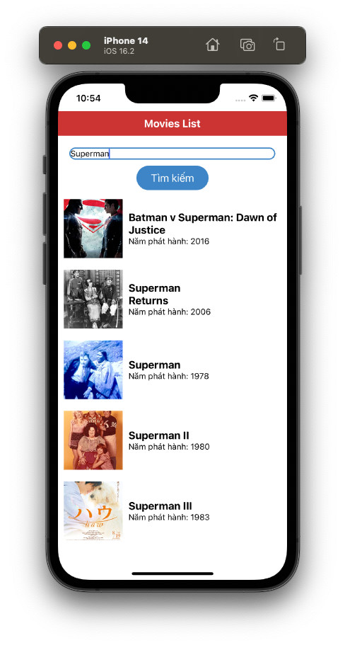
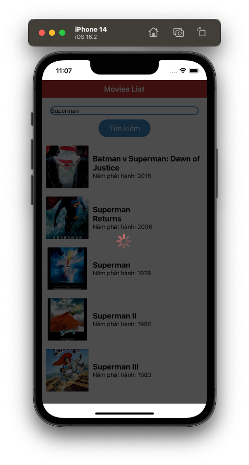

# Redux Sagas

Chúng ta tiếp tục hành trình mệt mỏi này với **React Native** nhóe. Chủ đề lần này là **Redux Sagas**, một trong những **Middleware** cần thiết giúp bạn tương tác với nhiều content khác nhau.

> Bắt đầu thôi!

## Bối cảnh

Với nền tảng này, mọi thứ đều có thể là **Middleware**. Điều này có thể đúng hoặc có thể sai. Nhưng nó đều phát sinh từ các điểm hạn chế trong phần thiết kế hệ thống dữ liệu trong **React Redux**. *(nói văn vẻ quá)*

2 điểm hạn chế với Redux mà bạn sẽ gặp là:

* Đồng bộ *(synchronous)*
* Không sử dụng được với *async/await*

Nó đến từ bản chất các functions trong *Redux* là *Pure Function*, nên không thể có sự tương tác bất đồng bộ được. Vả rồi từ đó, khái niệm Middleware được ra đời. Nó nằm giữa **Action & Reducers**.

> Redux Sagas cũng là một middleware.

## Khái niệm Redux Sagas

Redux Saga là một thư viện được dùng làm middleware cho Redux. Redux Saga cho phép Redux store tương tác với các tài nguyên bên ngoài một cách bất đồng bộ (asynchronously). Các tương tác có thể là gọi HTTP tới các API, đọc/ghi file...

Và đề phục vụ cho việc viết các function bất đồng bộ như là các function đồng bộ thì Redux Sagas sử dụng một cú pháp/tính năng từ ES6. Đó là Generators function.

> Khái niệm đơn giản như vậy thôi. Tạm thời, chúng ta bổ túc kiến thức về ES6 trước đã.

## Generators function

Bản chất các function sẽ thực hiện các lệnh trong bản thân nó từ trên xuống. Chúng ta không có lựa chọn nào để dừng việc thực thi function. Tất nhiên, bạn sẽ thắc mắc là có nhiều ngôn ngữ đã làm được. Đó là việc ngôn ngữ đó phát triễn tới mức cao cấp hơn rồi. Còn ta sẽ khám phát một thứ được xem là ở giai đoạn khai sáng trên. Đó chín là **Generators function**.

### Khái niệm

**Generator** có thể hiểu cơ bản là 1 **function** trong **javascript** có khả năng dừng việc thực thi function và rtiếp tục thực thi function khi 1 điều kiện được kích hoạt.

Đơn giản vậy thôi. Cú pháp của nó thì ta sử dụng với dấu `*` trong khai báo function nhóe.

```js
function* name([param[, param[, ... param]]]) {
  statements
}
```

Ví dụ code luôn nhóe!

```js
function *sing() {
    console.log('1');
    console.log('2');
    console.log('3');
    console.log('5');
    yield 'Anh có đánh rơi nhịp nào không?';
    yield '4 nhóe!';
}
```

Bạn sẽ chú ý rằng là các Generators function sẽ không có giá trị trả về hoặc kiểu giá trị trả về. Thay vào đó nó sẽ trả về 1 thứ gọi là **Iterable**.

### Iterable

Về Iterable nếu hiểu đơn giản thì như một collections (mãng), biết trước được số lượng phần tử. Nhưng thời điểm trả về sẽ không cùng một lúc. Bạn sẽ sử dụng các hàm `next()` để lấy tiếp các dữ liệu tiếp theo. Tiếp tục với ví dụ nhóe!

```js
function *sing() {
    console.log('1');
    console.log('2');
    console.log('3');
    console.log('5');
    yield 'Anh có đánh rơi nhịp nào không?';
    yield '4 nhóe!';
}

const msg = sing();
console.log(msg.next());
console.log(msg.next());
```

Thực thi đoạn code trên bạn sẽ hiểu được liền. Các dòng log sẽ chạy tới `5` và chờ chúng ta `next()` tiếp. Tuy nhiên, kết quả nhận được từ `next()` là một **object**, không phải một giái trị đơn thuần.

Kết quả như sau:

```js
1
2
3
5
{value: 'Anh có đánh rơi nhịp nào không?', done: false}
{value: '4 nhóe!', done: false}
```

### yield

Về cơ bản, yeild là từ khóa dùng để tạm dừng và cũng để tiếp tục việc thực thi bên trong generator function. Có như vậy thôi, function sẽ dừng lại tại câu lệnh `yield` để chờ `next()`. Đối tượng nhận được sẽ có 2 key:

* `value` : kết quả của biểu thức trả về.
* `done` : nhận giá trị **false** nếu quá trình generator chưa hoàn thành, **true** nếu ngược lại.

Giá trị của **index** được giữ lại sau mỗi lần chúng ta gọi `next()` và tất nhiên là cả ngữ cảnh của hàm generator cũng thế cho đến khi toàn bộ **yield**, **return** đã được duyệt qua.

Thử với ví dụ code sau nhóe

```js
function *sing() {
    yield '1';
    yield '2';
    yield '3';
    yield '5';
    yield 'Anh có đánh rơi nhịp nào không?';
    yield '4 nhóe!'
}

const msg = sing();
console.log(msg.next(3)); // {value: '1', done: false}
```

Mình cố tình đưa `next(3)` để mong muốn chúng nó in ra số `5` nhưng bất thành. Nó vẫn xác nhận đây là lần đầu tiên. Còn nếu chịu khó thì như sau:

```js
for (let e of msg) {
    console.log(e);
}
```

Vì bản chất của `msg` là iterable, thì nó có khả năng lặp & biết trước giá trị. Do đó, ta có thể sử dụng trong `for`. Cũng mệt hè.

### yield*

Để tăng thêm chú độ khó cho game thì chúng ta tới với khái niệm `yield*`. Chắc bạn cũng đoán ra 1 phần rồi. Đó chính là gọi Generator function trong Generator function. Với từ khóa sẽ là `yield*`. Cú pháp như sau:

```js
yield* [[expression]]
```

**Yield*** là một dạng ủy quyền thực thi. Ở đây, **yield*** có thể nhúng mã của một:

* Generator function
* Array
* String
* List
* ...

Chỉ cần là đối tượng thuộc kiểu Iterator là sẽ nhét vào **yeild*** được.  Xem ví dụ là hiểu liền thôi!

```js
function* f2() {
    yield 'Anh có đánh rơi nhịp nào không?';
    yield 'Méo có nhóe';
}

function* f1() {
    yield* [1,2,3,4,5];
    yield* '6789';
    yield* f2();
}

const interator = f1();

// 01
console.log(interator.next());
console.log(interator.next());
console.log(interator.next());
console.log(interator.next());
console.log(interator.next());
// 02
console.log(interator.next());
console.log(interator.next());
console.log(interator.next());
console.log(interator.next());
// 03
console.log(interator.next());
console.log(interator.next());
// Done
console.log(interator.next());
```
Thực thi chương trình và cảm nhận kết quả nhóe! Nhìn vào kết quả là bạn biết được cái gì đc trả về.

```
{value: 1, done: false}
{value: 2, done: false}
{value: 3, done: false}
{value: 4, done: false}
{value: 5, done: false}
{value: '6', done: false}
{value: '7', done: false}
{value: '8', done: false}
{value: '9', done: false}
{value: 'Anh có đánh rơi nhịp nào không?', done: false}
{value: 'Méo có nhóe', done: false}
{value: undefined, done: true}
```

Tạm thời kết thúc Generator Function nha, để dành thời gian sang nhân vật chính ngay bây giờ.

## Sử dụng Redux Sagas

Sau khi, bạn đã tìm hiểu khá cơ bản các thứ cần thiết rồi. Tiếp theo, chúng ta sẽ áp dụng Redux Sagas vào một project demo. Kinh điển nhất là ví dụ tương tác với API và sử dụng Redux Sagas

### Cài đặt thư viện Redux Sagas

```
npm install redux-saga
```

Để sử dụng Redux Sagas thì bạn cần phải cài đặt thêm nó vào project của bạn với lệnh như ở trên. Bạn có thể kiểm tra lại các thư viện khác đã được cài trong project bằng việc mở file `package.json`.

```json
  "dependencies": {
    "react": "18.2.0",
    "react-native": "0.71.3",
    "react-redux": "^8.0.5",
    "redux": "^4.2.1",
    "redux-saga": "^1.2.2"
  },
```

Mục đích giúp cho bạn có thể quản lý được version của các thư viện chúng ta thêm vào.


### Chuẩn bị View

Đầu tiên, bạn tạo một file màn hình mới. Mình đặt tên là `MoviesScreen` và sau đây là code tham khảo cho nó.

```js
import React, { useState } from 'react';
import { 
  StyleSheet, 
  View, 
  Text, 
  Image, 
  TextInput, 
  TouchableOpacity, 
  FlatList,
} from 'react-native';

import { useSelector, useDispatch } from 'react-redux';

const MoviesScreen = () => {
  const dispatch = useDispatch();
  const movies = [
    ...
  ]

  const [keyword, setKeyword] = useState("");

  const search = () => {
    console.log("send action with keyword: " + keyword);
  };

  const renderMovieItem = (item) => {
    return (
    <View style={styles.itemContainer}>
      <Image source={{uri: item.Poster}} style={styles.poster} />
      <View style={{marginHorizontal: 10}}>
        <Text style={styles.movieName}>{item.Title}</Text>
        <Text>Năm phát hành: {item.Year}</Text>
      </View>
    </View>
    )
  }

  return (
    <View style={{ flex: 1 }}>
      <View style={{ alignItems: 'center', backgroundColor: "#cc3333", padding: 10 }}>
        <Text style={styles.textHeader}>Movies List</Text>
      </View>
      {/* Giao diện thanh tìm kiếm */}
      <View style={styles.container}>
        <TextInput
          style={styles.searchInput}
          placeholder="Nhập từ khóa tìm kiếm"
          value={keyword}
          onChangeText={setKeyword}
        />
        <TouchableOpacity
          onPress={search}
          style={{ ...styles.btn, backgroundColor: '#3d85c6' }}>
          <Text style={styles.btnText}> Tìm kiếm </Text>
        </TouchableOpacity>
        {/* Giao diện danh sách phim được tìm thấy */}
        <FlatList
          data={movies}
          renderItem={({item}) => renderMovieItem(item)}
          ListHeaderComponent={() => (!movies.length ? 
            <Text>Không tìm thấy kêt quả phù hợp</Text>  
            : null)}
        />
      </View>
      
    </View>
  )
}

const styles = StyleSheet.create({
  textHeader: {
    fontSize: 18,
    fontWeight: "bold",
    color: "#FFFFFF"
  },
  container: {
    flex: 1,
    backgroundColor: '#fff',
    alignItems: 'center',
    flexDirection: 'column',
    paddingVertical: 20,
  },
  itemContainer: {
    height: 100, 
    flexDirection:'row', 
    alignItems: 'center',
    marginVertical: 10,
    padding: 10
  },
  poster: {
    width: 100, 
    height: 100,
  },
  movieName: {
    fontSize: 18,
    fontWeight: "bold",
    color: "#000000",
    width: "80%"
  },
  searchInput: {
    width: '90%',
    borderWidth: 2, 
    borderColor:"#3d85c6",
    borderRadius: 15,
  },
  btn: {
    backgroundColor: '#086972',
    paddingVertical: 10,
    paddingHorizontal: 20,
    margin: 10,
    borderRadius: 50,
  },
  btnText: {
    fontSize: 18,
    color: '#fff',
  },
})

export default MoviesScreen;
```

Trong đó:

* `movies` là array chứa dữ liệu
* `return` sẽ là 1 TextInput để nhập keyword và 1 List để hiện thị kết quả
* 2 functions cần cho màn hình là `search` & `renderMovieItem`


### Actions

Tiếp theo, ta cần phải khai báo các actions sẽ cần thiết cho Sagas. Trong phạm vi bài ta sẽ phân ra được 2 loại actions chính với các hoạt động khác nhau.

* Loại 1: liên quan trực tiếp tới Saga. Sau khi gọi Action này thì Saga sẽ tiếp tục thực thi trước khi chuyển qua các Reducers
* Loại 2: sau khi Saga hoàn thành logic của chúng. Nó sẽ gọi các Action loại này để tiến hành cập nhật State thông qua các Reducers (đây là bản chất gốc của Redux)

Chúng ta sẽ làm loại 1 trước. Còn loại 2 sẽ dùng để hoàn thiện project sau nhóe. Bạn tạo mới 1 file cho actions liên quan tới phần Movies, ví dụ tên `movieAction.js`. Tham khảo code sau:

```js
export function searchMovies (keyword) {
    console.log('action: ' + keyword);
    return {
        type: "FETCHING",
        payload: { keyword }
    }
}
```

Trong đó:

* Type của action là `FETCHING`
* Payload là `keyword` mà bạn sẽ nhập từ bàn phím

> Link API ta sẽ dùng như sau: https://omdbapi.com/?s=**<Từ khóa>** &apikey=5008fdeb

### Reducer

Khi đã có Action chính rồi thì tiếp theo là bạn cần tạo 1 Reducer để lưu trữ hay truy vấn State từ Store nhóe. Tạo mới 1 file Reducer với file tên là `movieReducer.js`. Code ví dụ như sau:

```js
const initialState = {
    moviesSearch: [],
}

export default (state = initialState, action) => {
    switch (action.type) {
        case 'MOVIE_FETCHING':
            console.log("---------------");
            console.log(action.type);
            return {
                ...state,
            };
        default:
            return state;
    }
}
```

Trong đó:

* `initialState` là Stare khởi tạo được lưu trong Store dành riêng cho phần Movies. Trong này ta có 1 array dùng để lưu trữ các item lấy được từ API
* Chúng ta sẽ có nhiều Action khác nhau liên quan tới MovieReducer này.
* Xử lý action chính là 'MOVIE_FETCHING'

> Chúng ta sẽ kết hợp nhiều Reducer trong cùng 1 project

Hiện tại, ta mới đang setup thôi nên chưa có xử lý logic gì nhiều ở đây. Nên sẽ `return` về đúng State ban đầu.

### Axios

Đây là thư viện giúp bạn xử lý việc gọi API để lấy dữ liệu. Gõ lệnh sau vào Terminal để cài đặt thư viện

```
npm install axios
```

Chắc phải tìm hiểu sau thôi chứ nhìn méo hiểu chi. Nhưng bạn cần tạo 1 thư mục là `axios` và 1 file là `index.js` để cấu hình việc tương tác API.

```js
export default async function callApi(url, method, params) {
    let headers = {
        'cache-control': 'no-cache',
        'Content-Type': 'application/json; charset=utf-8', device: 'MOBILE',
        client: Platform.OS,
    };

    let options = {
        headers,
        method,
        url,
        params,
        timeout: 15 * 1000
    };

    return axios(options);
```

Trong đó:

 * Axios là thư viện hỗ trợ kết nối HTTP request.
 * Tạo hàm wrapper axios để gọi axios đơn giản và dễ hiểu hơn.
 * @param {*} url - endpoint của API
 * @param {*} method - kiểu HTTP request: GET, POST, UPDATE,DELETE...
 * @param {*} params - tham số truyền vào cho request * @returns axios instance

## Xử lý logic với Sagas

Bây giờ, chúng ta sẽ vào phần chính là tập trung tương tác với Sagas nhóe.

Bạn hãy tạo thêm 1 thư mục tên là `sagas` để phục vụ việc xử lý tập trung các phần khác nhau liên quan tới Sagas. Sau đó, bạn tạo mới 2 file JS là:

* `index.js` : dùng để khai báo Root Sagas cho project
* `movieSage.js` : dùng để xử lý các tác vụ liên quan tới phần Movie với Sagas

### Movie Saga

Tại file `movieSaga.js` bạn sẽ xử lý chính tác vụ liên quan tới việc Fetching dữ liệu.

```js
import callApi from "../axios";
import { takeLatest , put } from 'redux-saga/effects';

export function* fetchMovies({payload}) {
    const {keyword} = payload;
    console.log("OK: " + keyword);

    const ENDPOINT = "https://omdbapi.com";
    console.log("ENDPOIN: " + ENDPOINT);
    const res = yield callApi(ENDPOINT, "GET", {s: keyword, apikey: "5008fdeb"});

    yield put({type: 'MOVIE_FETCHING', payload: res?.data?.Search || []});

}

export const MovieSagas = [
    takeLatest("FETCHING", fetchMovies)
];
```

Trong đó:

* `takeLatest` và `put` là các function của Saga. Bạn sẽ tìm hiểu sau nhóe.
* Generation Function chính là `fetchMovies` ở đây có tác vụ bất đồng bộ là `callApi` từ axios
* Bạn sẽ sử dụng từ khóa `yield` để tương tác với các function khác bất đồng bộ
* `export` ra một thứ gì đó (không biết gọi là gì) với tên là MovieSages.

Nhiệm vụ chính của Sagas sẽ bắt tất cả các action với type là `FETCHING`. Thay vì như tư tưởng của React Redux sẽ gọi tiếp Reducer. Thì Sagas sẽ bắt và chạy trước với function được gọi là `fetchMovies`. Kết quả sau đó mới truyền cho Reducer.

Sau khi, `callApi` thành công thì bạn sẽ tiến hành gọi tiếp Action là `MOVIE_FETCHING `. Tới lúc này thì đưa xử lý về đúng với tư tương của React Redux nhóe, là từ Action sang Reducer.

Dữ liệu nạp vào `payload` là array items lấy từ API. Do đó, bạn cần về file `movieReducer.js` để cập nhật thêm vào Action đó là nạp dữ liệu vào `initialState`.

```js
const initialState = {
  moviesSearch: [],
};
export default (state = initialState, action) => {
  switch (action.type) {
    case 'MOVIE_FETCHING':
return {
...state,
moviesSearch: action.payload
}; default:
      return state;
  }
};
```

### Root Saga

Sau khi bạn đã xử lý xong logic Saga cho Movie. Thì bạn sẽ cần tạo ra 1 Saga gốc để quản lý tất cả các Saga trong project. Mở file `index.js` của nó vừa tạo ở trên lên và tiếp tục code nào.

```js
import {all} from 'redux-saga/effects';
import {MovieSagas} from './movieSaga';
export default function* rootSaga() {
  yield all([
    ...MovieSagas
  ]);
}
```

Thực chất, bạn có thể gọi riêng lẻ các phần Saga (như MovieSaga) để chạy ở Store. Tuy nhiên, chúng ta sẽ suy nghĩ việc sau này có thể mở rông project mình với nhiều tính năng hơn à. Còn với hàm `all()` có tác dụng thực hiện song song tất cả các saga.

### Cấu hình Middleware với Saga

Tới được đây, bạn mới xong phần setup các thứ linh tinh. Việc cuối cùng của việc cấu hình này là kết nối chúng lại ở Store. Đây chính là Middleware mà bạn đã được tìm hiểu sơ qua ở trên rồi.

Mình sẽ sử dụng lại file `store.js` đã được cấu hình với Count Reducer tại bài trước, và thêm Movie Reducer tiếp vào.

```js
import { legacy_createStore as createStore, combineReducers, applyMiddleware } from "redux";
import countReducer from "./reducers/countReducer";
import movieReducer from "./reducers/movieReducer";

/**
 * Sagas
 */
import createSagaMiddleware from "@redux-saga/core";
const sagaMiddleware = createSagaMiddleware();
import rootSaga from "../sagas";

/**
 * Hợp nhất tất các Reducers lại vào 1 mối chính
 */
const rootReducer = combineReducers({
    count: countReducer,
    movie: movieReducer,
});

/**
 * Tạo store
 */
//export const store = createStore(rootReducer);
const store = createStore(rootReducer, applyMiddleware(sagaMiddleware));
sagaMiddleware.run(rootSaga);

export default store;
```

Trong đó:

* `import` các Reducer cần thiết trong 1 project nhóe
* Cập nhật lại `rootReducer` với đầy đủ các Reducer
* Tiếp theo là phần Sagas thì bạn cần tạo `createSagaMiddleware` để apply vào `store` quan hàm `applyMiddleware()` nhóe

Có nghĩa vẫn là Store của bài trước. Nhưng được nâng cấp với Middleware là Saga. Cuối cùng, bạn khởi chạy Saga luôn ngày từ đầu, với gọi hàm `sagaMiddleware.run(rootSaga);` nhóe.

Tới đây, chúng ta đã cài đặt & xử lý logic ổn rồi nhóe. Sang phần tương tác với UI nào.

## Tương tác với UI

Ta sẽ kết nối với UI và cập nhật UI với các State ở Store nhóe. Bạn mở file `MoviesScreen` và thêm các thuộc tính sau:

```js
const movies = useSelector(store => store.movie.moviesSearch || []);
```

Vẫn sử dụng các hook `useSelector` để kết nối với 1 Stare nào đó trong Store. Mỗi khi dữ liệu được cập nhật cho Store thì thuộc tính `movies` cũng được cập nhật theo.

Tiếp theo, xử lý sự kiện nhất nút Search của người dùng. Tại đây, bạn vẫn sử dụng `dispatch` để gọi action chính nhóe.

```js
const search = () => {
	console.log("send action with keyword: " + keyword);
  dispatch(searchMovies(keyword));
};
```

Bấn `r` hoặc `run` lại Project nhóe. Sau đó thử gõ vào vài từ khóa để kiểm tra chúng hoạt động không. Nếu ổn thi ra như thế này.



## Hoàn thiện UI

Ở trên mình có nhắc tới 2 loại Action sẽ được sử dụng. Loại chính thì chúng ta đã làm xong rồi. Còn bây giờ, ta sẽ xử lý loại thứ 2. Đó chính các side effect liên quan tới việc xử lý chính của ta.

Thử tưởng tượng gọi API là nhiệm vụ chính. Nhưng người dùng sẽ không biết nó chạy xong hay chưa. Do đó, ta cần xử lý thêm 2 việc nữa.

* Show Loading : trước lúc gọi API để biết là ứng dụng đang tương tác với một cái gì đó
* Hide Loading : để ẩn đi Loading khi kết thúc việc xử lý chính

### Cập nhật State

Cũng như bao thứ khác, việc ẩn hiện Loading thì cũng được quản lý bằng một State nhóe. Do đó, bạn hãy thêm State vào thôi. Cập nhật lại file `movieReducer.js` nhoa.

```js
const initialState = { 
	moviesSearch: [], 
	isLoading: false
};
```

### Cập nhật Reducer

Vì ta có thêm State và thêm Action phụ, nên cũng phải cần thêm xử lý ở Reducer nữa. Tiếp tục cập nhật Movie Reducer nhóe~

```js
export default (state = initialState, action) => {
    switch (action.type) {
        case 'MOVIE_FETCHING':
            console.log("---------------");
            console.log(action.type);
            return {
                ...state,
                moviesSearch: action.payload
            };
        case 'SHOW_LOADING':
            return {
                ...state,
                isLoading: true
            };
        case 'HIDE_LOADING':
            return {
                ...state,
                isLoading: false
            };
        default:
            return state;
    }
}
```

Nó đơn giản là truyền `true` hay `false` cho `isLoading` mà thôi. EZ Game!

> Nếu như bạn thích phức tạp thì có thể define thêm các Action phụ ở file Action. Lúc này, code của bạn nhìn zé hơn chút à.

### Cập nhật Saga

Tiếp theo, bạn cần cập nhật các bước gọi các action trong phần xử lý Saga chính nữa nhóe. Mở file `movieSaga.js` và tiến hành cập nhật cho function `fetchMovies`

```js
export function* fetchMovies({payload}) {
    const {keyword} = payload;
    console.log("OK: " + keyword);

    // show loading
    yield put({type: 'SHOW_LOADING'});

    const ENDPOINT = "https://omdbapi.com";
    console.log("ENDPOIN: " + ENDPOINT);
    const res = yield callApi(ENDPOINT, "GET", {s: keyword, apikey: "5008fdeb"});

    yield put({type: 'MOVIE_FETCHING', payload: res?.data?.Search || []});

    // hide loading
    yield put({type: 'HIDE_LOADING'});
}
```

Bạn chỉ cần chú ý 2 phần **show & hide Loading** mà thôi. Chú ý là gọi cho đúng `type` nhóe.

### Cập nhật UI

Cuối cùng, là cập nhật UI chính tại `MovieScreen` nhóe. Bạn cần thêm 1 thuộc tính để lấy State quản lý việc show/hide loading.

```js
const isLoading = useSelector(store => store.movie.isLoading);
```

Sau đó, bạn tùy ý mà sử dụng State đó với các UI nhóe. Ví dụ thôi

```js
  return (
    <View style={{ flex: 1 }}>
      
      //....
      
      {/** Loading UI */}
      {isLoading && (
      <View style={styles.loading}>
        <ActivityIndicator size='large' color="#cc3333" />
      </View>
      )}
      
      //.....
      
    </View>
  )
```

Bạn tự thiết kế Style theo suy nghĩ của bạn nhóe. Sau đó, test lại một lần cuối cùng.



Chúc bạn thành công!

## Tóm tắt

Sagas là một Middleware giúp bạn xử lý các tác vụ bất đồng bộ. Nó can thiệp khúc giữa Action tới Reducer mà thôi.

> Action > **Saga** > Reducer > Store > UI

* Có nhiều Action liên quan tới 1 action chính mà Saga xử lý. Do đó, tác dụng tiếp theo của Saga là điều khiển luồng sự kiện. Nhất là các side effect.
* Sagas sẽ khởi chạy ngay khi app khởi chạy
* Gom các Saga riêng lẻ cho từng tính năng về 1 Root Saga chung
* Khai báo Action, Reducer vẫn tương tự với React Redux. Nếu càng chi tiết thì càng tốt

Bạn cần chú ý các function trong Saga, tùy thuộc vào mục đính bạn gọi mà hãy chọn function cho phù hợp.

* `takeLatest` sẽ lấy action cuối cùng
* `put` dùng để gọi các action không liên quan tới bất đồng bộ. Nó sẽ thực thi ngay
* `call` dùng để gọi các xử lý bất đồng bộ, nó sẽ vào ngăn xếp và chờ để chạy

Do số lượng file phát khi khi kết hợp **React Redux** và **Redux Sagas**. Nên hãy phân chia bố cụ cấu trúc file hợp lý ngày tư đầu. Dùng thêm các thư viện khác như là **Redux tools kit** để quản lý tốt hơn. Vẫn phải thực hiện các việc theo thứ tự từ `cấu hình chung` > `cấu hình các reducer/saga` riêng lẻ > cập nhật logic > store > UI nhóe.

Cảm ơn bạn đã đọc!

---

*(Chúc bạn một ngày tốt lành và cảm ơn bạn đã ghé thăm repo này.)*